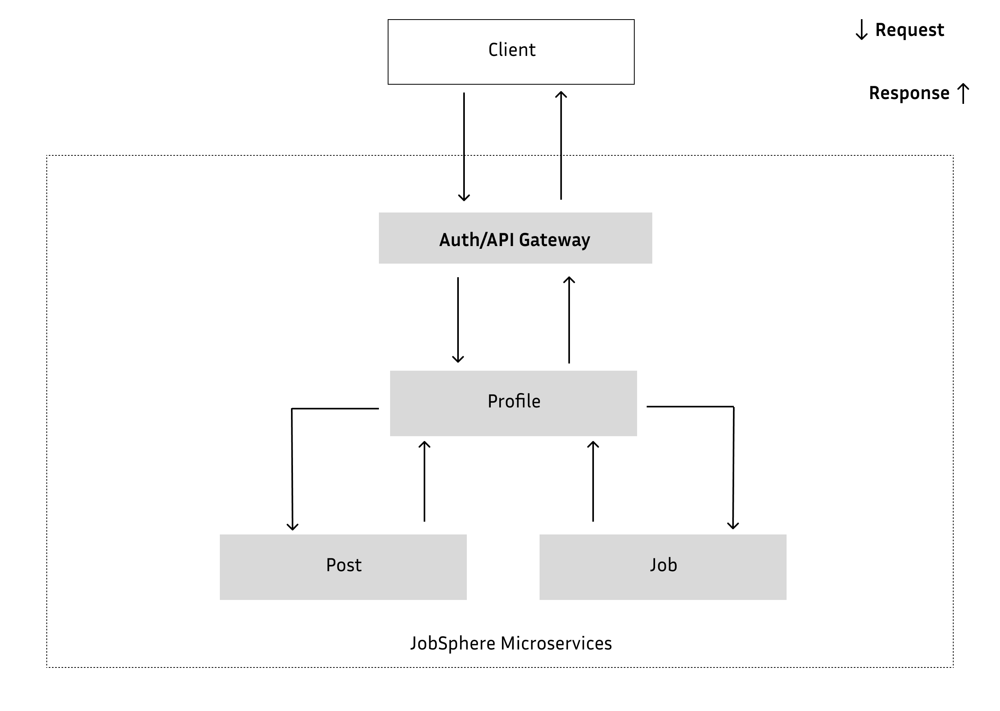
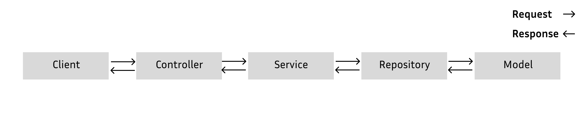

# JobSphere-SDLC:

<!-- TOC -->

-   [JobSphere-SDLC:](#jobsphere-sdlc)
    -   [1. Requirements Gathering](#1-requirements-gathering)
    -   [2. System Design \& Architecture](#2-system-design--architecture)
    -   [3. Data Flow Diagrams (DFD)](#3-data-flow-diagrams-dfd)
    -   [4. Detailed System Design](#4-detailed-system-design)
    -   [5. SDLC Approach \& Project Execution](#5-sdlc-approach--project-execution)
    -   [6. Approaches \& Best Practices](#6-approaches--best-practices)
    -   [7. Deployment \& Maintenance](#7-deployment--maintenance)

## 1. Requirements Gathering

-   **User Roles and Permissions:**

    -   The Platform will be used by Job Seekers, Recruiters and other people who would want to post/share any opportunities.

-   **Core Features:**

    -   _Job and Post Creation:_ Users will be allowed to create and share the job and posts.
    -   _Profile Building:_ Users can create detailed profile.
    -   _Search and Filter:_ Jobs and profiles will be easy to search with filters by location, job type, skills and experience level.

-   **Additional Features:**

    -   _Non-functional Requirements:_ Performance, scalability and availability. Data security, user privacy, and adherence to relevant legal standards (like GDPR) will also be available.

## 2. System Design & Architecture

-   **High-Level Architecture:**

    -   [ ] _Frontend:_ A responsive web and mobile deal with a clean UX using Next.js.
    -   [x] _Backend:_ Microservices architecture with RESTful APIs, built using the robust backend framework Spring Boot.
    -   [x] _Database:_ SQL for structured data such as user profiles, jobs and posts.
    -   [ ] _Caching Layer:_ Using Caffeine for frequently used data.
    -   [ ] _Message Queues:_ Kafka for managing notifications and asynchronous tasks.

-   **Microservices Breakdown:**

    -   [ ] _Auth/API Gateway:_ Gateway to map the request to dedicated endpoints, and will also deal with authentication, authorization.
    -   [x] _Profile Service:_ Manages User profiles.
    -   [x] _Job Service:_ Handles Job creation, editing and searching.
    -   [x] _Post Service:_ Handles Post creation, editing and searching.

-   **Scalability & Fault Tolerance:**

    -   [ ] Docker for containerization.

## 3. Data Flow Diagrams (DFD)

-   _Level 0 (Context Diagram):_ Simple overview showing interaction from Client to the Job Sphere system.

    

-   _Level 1 DFD:_ Detail on how data flows between core components: user profiles, job postings, application processes.

    

<!-- -   _Level 2+ DFD: _ Dive into specific flows, like the user profile creation process, job search and filtering, and the recommendation algorithm. -->

## 4. Detailed System Design

-   ### APIs & Database Schema:

    -   ### Endpoints:

        -   #### For Profile:

            -   Create Profile `/profile`

                | Method | Description                                                   |
                | :----: | :------------------------------------------------------------ |
                | `POST` | A **POST** request to this endpoint will create a new Profile |

            -   Profile by ID `/profile/{profile_id}`

                |  Method  | Description                                                                                |
                | :------: | :----------------------------------------------------------------------------------------- |
                |  `PUT`   | A **PUT** request with Profile ID to this endpoint will update the Profile.                |
                |  `GET`   | A **GET** request with Profile ID to this endpoint will return profile details of that ID. |
                | `DELETE` | A **DELETE** request with Profile ID will delete the specific profile.                     |

        -   #### For Job:

            -   Get all Jobs `/job`

                | Method | Description                                                        |
                | :----: | :----------------------------------------------------------------- |
                | `GET`  | A **GET** request to this endpoint will return all available Jobs. |

            -   Job by Profile ID `{profile_id}/job`

                | Method | Description                                                                                |
                | :----: | :----------------------------------------------------------------------------------------- |
                | `POST` | A **POST** request with Profile ID to this endpoint will create a new Job.                 |
                | `GET`  | A **GET** request with Profile ID to this endpoint will return all Job(s) from Profile ID. |

            -   Job by Profile and Job ID `{profile_id}/job/{job_id}`

                |  Method  | Description                                                                                         |
                | :------: | :-------------------------------------------------------------------------------------------------- |
                |  `PUT`   | A **PUT** request with Profile ID and Job ID will update the specific job from specific profile.    |
                |  `GET`   | A **GET** request with Profile ID and Job ID will retrieve the specific job from specific profile.  |
                | `DELETE` | A **DELETE** request with Profile ID and Job ID will delete the specific job from specific profile. |

        -   #### For Post:

            -   Get all Posts `/post`

                | Method | Description                                                         |
                | :----: | :------------------------------------------------------------------ |
                | `GET`  | A **GET** request to this endpoint will return all available Posts. |

            -   Post by Profile ID `{profile_id}/post`

                | Method | Description                                                                               |
                | :----- | ----------------------------------------------------------------------------------------- |
                | `POST` | A **POST** request with Profile ID to this endpoint will create a new Post.               |
                | `GET`  | A **GET** request with Profile ID to this endpoint will return all posts from Profile ID. |

            -   Post by Profile and Post ID `{profile_id}/post/{post_id}`

                |  Method  | Description                                                                                           |
                | :------: | :---------------------------------------------------------------------------------------------------- |
                |  `PUT`   | A **PUT** request with Profile ID and Post ID will update the specific post from specific profile.    |
                |  `GET`   | A **GET** request with Profile ID and Post ID will retrieve the specific post from specific profile.  |
                | `DELETE` | A **DELETE** request with Profile ID and Post ID will delete the specific post from specific profile. |

             <!-- — Define endpoints for all key actions
             -   A relational database schema for structured data, covering tables for users, jobs, posts. -->

    -   ### Data Models:

        -   _Authentication:_

            | Auth          |  Type  |
            | :------------ | :----: |
            | email         | String |
            | phone         | String |
            | username      | String |
            | password_hash | String |

        -   _Profile:_

            | Profile      |  Type   |
            | :----------- | :-----: |
            | id           |  UUID   |
            | first_name   | String  |
            | last_name    | String  |
            | username     | String  |
            | phone        | String  |
            | email        | String  |
            | organization | String  |
            | experience   | Integer |
            | posts        |  Array  |
            | jobs         |  Array  |

        -   _Job:_

            | Job            |   Type    |
            | :------------- | :-------: |
            | id             |   UUID    |
            | title          |  String   |
            | description    |  String   |
            | skills         |   Array   |
            | location       |  String   |
            | type           |  String   |
            | organization   |  String   |
            | no_of_openings |  Integer  |
            | posted_by      |  String   |
            | created_at     | Date/Time |
            | updated_at     | Date/Time |

        -   _Post:_

            | Post       |   Type    |
            | :--------- | :-------: |
            | id         |   UUID    |
            | title      |  String   |
            | content    |  String   |
            | url        |   Array   |
            | created_by |  String   |
            | created_at | Date/Time |
            | updated_at | Date/Time |

    -   ### Data Privacy & Security:

        -   [ ] Implementation of JWT-based authentication for API security.
        -   [ ] Encrypt sensitive data like passwords and ensure compliance with privacy laws.

## 5. SDLC Approach & Project Execution

-   Planning & Sprint Setup:

    -   [x] Define project milestones based on functionality (profile, job and post).

-   Development Phases:

    -   [x] _Phase 1:_ Build core functionality – user registration, profile setup, job and post creation.
    -   [ ] _Phase 2:_ Implement application tracking, search and filter, notifications.
    -   [ ] _Phase 3:_ Final touches, optimizations, and preparing for deployment.

-   Testing:

    -   [ ] _Unit Testing:_ Individual components like profile, jobs and posting functions.
    -   [ ] _Integration Testing:_ Ensure seamless interactions across microservices.

## 6. Approaches & Best Practices

-   _CI/CD Pipeline:_ Automate testing, code quality checks, and deployments using a CI/CD tool GitHub Actions.
-   _Version Control:_ Using Git for managing code and tracking changes across the development team.
-   _Documentation:_ Document API endpoints, architectural decisions, and workflows. Keep it up to date for maintainability.

-   Monitoring & Logging:

    -   Use actuator for tracking endpoints health.
    -   Set up alerts for performance errors, and unusual activity.

## 7. Deployment & Maintenance

-   _Regular Updates & Feature Additions:_ Post-deployment, update the platform based on feedback. Introduce new features and enhance existing ones for better UX.
